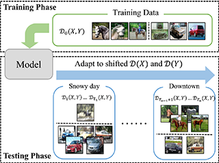








# 🤵🏻 About Me

I am a second-year Ph.D. student at [the Department of Computer Science and Technology](https://cs.nju.edu.cn/main.htm) of [Nanjing University](https://www.nju.edu.cn/) advised by Professor [Yu-Feng Li (李宇峰)](https://cs.nju.edu.cn/liyf/index.htm), and a member of [LAMDA Group (机器学习与数据挖掘研究所)](https://www.lamda.nju.edu.cn/CH.MainPage.ashx), which is led by Professor [Zhi-Hua Zhou (周志华)](https://cs.nju.edu.cn/zhouzh/index.htm).

I received my B.Sc. degree from [the Department of Computer Science and Technology](http://ccst.jlu.edu.cn/) of [Jilin University](https://www.jlu.edu.cn/). In September 2022, I was admitted to study for a Ph.D. degree at Nanjing University without an entrance examination.

<!-- # 🔥 News
- *2022.02*: &nbsp;🎉🎉 Lorem ipsum dolor sit amet, consectetur adipiscing elit. Vivamus ornare aliquet ipsum, ac tempus justo dapibus sit amet. 
- *2022.02*: &nbsp;🎉🎉 Lorem ipsum dolor sit amet, consectetur adipiscing elit. Vivamus ornare aliquet ipsum, ac tempus justo dapibus sit amet.  -->

# 📝 Publication 

<!-- 

ICML 2023

**ODS: Test-Time Adaptation in the Presence of Open-World Data Shift.**

**Zhi Zhou**, Lan-Zhe Guo, Lin-Han Jia, Ding-Chu Zhang, Yu-Feng Li.

In: Proceedings of the 40th International Conference on Machine Learning, Hawaii, 2023. 

Oral Presentation.
[[Paper]](../resources/ICML2023_ODS.pdf) 
[[Code]](https://www.lamda.nju.edu.cn/code_ODS.ashx)
[[Poster]](../resources/ICML2023_ODS_Poster.png)
[[Slide]](../resources/ICML2023_ODS_Slides.pdf) 
[[Video]](https://icml.cc/virtual/2023/poster/24841)

 -->

## Conference Papers

- **A Benchmark on Robust Semi-Supervised Learning in Open Environments.**   Lin-Han Jia, Lan-Zhe Guo, **Zhi Zhou**, Yu-Feng Li.  
In: Proceedings of the 12th International Conference on Learning Representations, 2024.  
ICLR 2024.

- **Robust Test-Time Adaptation for Zero-Shot Prompt Tuning.**  
Ding-Chu Zhang, **Zhi Zhou (co-first author)**, Yu-Feng Li.  
In: Proceedings of the 38th AAAI conference on Artificial Intelligence, Vancouver, 2024.  
AAAI 2024.
CCF-A.
[[Paper]](../resources/AAAI2024_AdaPrompt.pdf) 
[[Code]](https://github.com/zhangdingchu/Adaprompt)
[[Poster]](../resources/AAAI2024_AdaPrompt_Poster.pdf)
[[Slide]](../resources/AAAI2024_AdaPrompt_Slide.pdf) 

- **ODS: Test-Time Adaptation in the Presence of Open-World Data Shift.**  
**Zhi Zhou**, Lan-Zhe Guo, Lin-Han Jia, Ding-Chu Zhang, Yu-Feng Li.  
In: Proceedings of the 40th International Conference on Machine Learning, Hawaii, 2023. Page: 42574-42588. 
ICML 2023.
Oral Presentation.
CCF-A.
[[Paper]](../resources/ICML2023_ODS.pdf) 
[[Code]](https://www.lamda.nju.edu.cn/code_ODS.ashx)
[[Poster]](../resources/ICML2023_ODS_Poster.png)
[[Slide]](../resources/ICML2023_ODS_Slide.pdf) 
[[Video]](https://icml.cc/virtual/2023/poster/24841)

- **Bidirectional Adaptation for Robust Semi-Supervised Learning with Inconsistent Data Distributions.**  
Lin-Han Jia, Lan-Zhe Guo, **Zhi Zhou**, Jie-Jing Shao, Yu-Ke Xiang, Yu-Feng Li.  
In: Proceedings of the 40th International Conference on Machine Learning, Hawaii, 2023. Page: 14886-14901. 
ICML 2023.
Oral Presentation.
CCF-A.
[[Paper]](../resources/ICML2023_SSL.pdf)
[[Code]](https://github.com/YGZWQZD/LAMDA-SSL) 

- **Identifying Useful Learnwares for Heterogeneous Label Spaces.**  
Lan-Zhe Guo, **Zhi Zhou (co-first author)**, Yu-Feng Li, Zhi-Hua Zhou.  
In: Proceedings of the 40th International Conference on Machine Learning, Hawaii, 2023. Page: 12122-12131.  
ICML 2023.
CCF-A.
[[Paper]](../resources/ICML2023_learnware.pdf)
[[Poster]](../resources/ICML2023_learnware_Poster.png)

- **USB: A Unified Semi-supervised Learning Benchmark for Classification.**  
Yi-Dong Wang, Hao Chen, Yue Fan, Wang Sun, Ran Tao, Wen-Xin Hou, Ren-Jie Wang, Lin-Yi Yang, **Zhi Zhou**, Lan-Zhe Guo, He-Li Qi, Zhen Wu, Yu-Feng Li, Satoshi Nakamura, Wei Ye, Marios Savvides, Bhiksha Raj, Takahiro Shinozaki, Bernt Schiele, Jin-Dong Wang, Xing Xie, Yue Zhang. 
In: Advances in Neural Information Processing Systems Datasets and Benchmarks, New Orleans, LA, 2022. Page: 3938-3961. 
NeurIPS 2022 Datasets and Benchmarks.
CCF-A.
[[Paper]](../resources/NeurIPS2022_USB.pdf)
[[Code]](https://github.com/microsoft/Semi-supervised-learning)

- **STEP: Out-of-Distribution Detection in the Presence of Limited In-Distribution Labeled Data.**  
**Zhi Zhou**, Lan-Zhe Guo, Zhan-Zhan Cheng, Yu-Feng Li, Shi-Liang Pu. 
In: Advances in Neural Information Processing Systems, Virtual Conference, 2021. Page: 29168-29180.  
NeurIPS 2021.
CCF-A.
[[Paper]](../resources/NeurIPS2021_STEP.pdf)
[[Code]](https://www.lamda.nju.edu.cn/code_STEP.ashx) 
[[Poster]](../resources/NeurIPS2021_STEP_Poster.png)
[[Slide]](../resources/NeurIPS2021_STEP_Slide.pdf)

- **Learning from Imbalanced and Incomplete Supervision with Its Application to Ride-Sharing Liability Judgment.**  
Lan-Zhe Guo, **Zhi Zhou (co-first author)**, Jie-Jing Shao, Yu-Feng Li, and DiDi Collaborators. 
In: Proceedings of the 27th ACM SIGKDD Conference on Knowledge Discovery and Data Mining, Singapore, 2021. Page: 487-495.  
KDD 2021.
CCF-A.
[[Paper]](../resources/KDD2021_LIMI.pdf)

- **RECORD: Resource Constrained Semi-Supervised Learning under Distribution Shift.**  
Lan-Zhe Guo, **Zhi Zhou**, and Yu-Feng Li. 
In: Proceedings of the 26th ACM SIGKDD Conference on Knowledge Discovery and Data Mining, San Diego, CA, 2020. Page: 1636-1644.  
KDD 2020.
CCF-A.
[[Paper]](../resources/KDD2020_RECORD.pdf)
[[Code]](https://www.lamda.nju.edu.cn/code_RECORD.ashx)

## Journal Papers

- **Rts: Learning Robustly from Time Series Data with Noisy Label.**  
**Zhi Zhou**, Yi-Xuan Jin, Yu-Feng Li.  
Frontiers of Computer Science, 18(6): 186332, 2024.  
FCS.
CCF-B.
[[Paper]](https://journal.hep.com.cn/fcs/EN/10.1007/s11704-023-3200-z)
[[Code]](https://github.com/WNJXYK/Rts) 

- **LAMDA-SSL: A Comprehensive Semi-Supervised Learning Toolkit.**  
Lin-Han Jia, Lan-Zhe Guo, **Zhi Zhou**, Yu-Feng Li.  
Science CHINA Information Science, 67: 117101, 2024.  
SCIS.
CCF-A.
[[Arxiv]](https://arxiv.org/pdf/2208.04610.pdf)
[[Code]](https://github.com/YGZWQZD/LAMDA-SSL) 

- **Towards Robust Test-Time Adaptation for Open-Set Recognition**  
**Zhi Zhou**, Ding-Chu Zhang, Yu-Feng Li, Min-Ling Zhang.  
Journal of Software (软件学报), 35(4), 2024.  
JOS.
CCF-A.
[[Paper]](http://www.jos.org.cn/jos/article/abstract/7009?st=article_issue&bsh_bid=5968787845)

## Other Papers

- **You Only Submit One Image to Find the Most Suitable Generative Model**  
**Zhi Zhou**, Lan-Zhe Guo, Pengxiao Song, Yu-Feng Li.  
NeurIPS 2023 Diffusion Workshop.  
[[Page]](https://neurips.cc/virtual/2023/74865)

# 🛠 Software

- LawGPT: A Large Language Model in the Legal Domain. [[GitHub]](https://github.com/pengxiao-song/LaWGPT) 
- LAMDA-SSL: A Comprehensive and Easy-to-Use Toolkit for Semi-Supervised Learning. [[GitHub]](https://github.com/YGZWQZD/LAMDA-SSL) 
<!-- - USB: A Unified Semi-supervised learning Benchmark for CV, NLP, and Audio Classification. [[GitHub]](https://github.com/microsoft/Semi-supervised-learning) -->

# 💻 Project

- *2022.06 - 2023.06*, Fraud Detection System based on Weakly Supervised Learning, [Huawei](../resources/Huawei2023_Award.pdf), China.
- *2021.10 - 2022.05*, Housing Sales Customer Rating Model Optimization, [Beike (Internship)](../resources/Beike2021.pdf), China.
- *2021.03 - 2022.12*, Concept Incremental Learning with Active Anotations, Hikvision, China.
- *2020.07 - 2021.09*, Liability Judgment System based on Semi-Supervised Multi-Label Learning, Didi (Internship), China.

# 🎖 Honor

- *2023.12*, National Scholarship, Nanjing University.
- *2023.11*, [China Mobile Hackathon - University Joint Research Institute Special Competition in Machine Vision and Artificial Intelligence](../resources/NJU2023_AIHackathon.pdf), Nanjing University.
- *2022.06*, [LAMDA Excellent Student Award](../resources/LAMDA2022_Elite.pdf), Nanjing University.
- *2022.03*, [Tencent Scholarship](../resources/Tencent2021_Scholarship.pdf), Nanjing University.
- *2020.06*, [Top 10 College Student of the Year](../resources/JLU2019_Top10.pdf), Jilin University.
- *2019.12*, [National Scholarship](../resources/JLU2019_NationalScholarship.pdf), Jilin University.
- *2019.10*, CCF Collegiate Computer Systems & Programming Contest, [Gold Medal (11th)](../resources/CCSP2019.pdf), Suzhou.
- *2019.06*, [Tang Aoqing Honors Program of Research & Practice](../resources/JLU2019_TAQScholarship.jpg), Jilin University.
- *2018.12*, ACM-ICPC Asia Regional Contest, [Gold Medal (19th)](../resources/ICPC2018_ECFinal.pdf), EC-Final.
- *2018.11*, [National Scholarship](../resources/JLU2018_NationalScholarship.jpg), Jilin University.
- *2018.10*, ACM-ICPC Asia Regional Contest, [Gold Medal](../resources/ICPC2018_Xuzhou.pdf), Xuzhou.
- *2018.10*, ACM-ICPC Asia Regional Contest, [Gold Medal (16th)](../resources/ICPC2018_Shenyang.pdf), Shenyang.
- *2018.09*, China Collegiate Programming Contest, [Gold Medal (4th)](../resources/CCPC2018_Qinghuangdao.pdf), Qinhuangdao.
- *2018.09*, China Collegiate Programming Contest, [Gold Medal (10th)](../resources/CCPC2018_Jilin.pdf), Jilin.
- *2018.06*, [Tang Aoqing Honors Program of Research & Practice](../resources/JLU2018_TAQScholarship.jpg), Jilin University.
- *2017.11*, [National Scholarship](../resources/JLU2017_NationalScholarship.jpg), Jilin University.

# 🤝 Activity

## Conference Committee

- Senior Program Committee Member, ACML 2022.
- Program Committee Member, NeurIPS 2022/2023.
- Program Committee Member, ICML 2022/2023/2024.
- Program Committee Member, ICLR 2024.
- Program Committee Member, AAAI 2023/2024.
- Program Committee Member, ECAI 2023/2024.

## Journal Reviewer
- Reviewer for Machine Learning Journal (MLJ)
- Reviewer for IEEE Transactions on Knowledge and Data Engineering (TKDE)
- Reviewer for Frontiers of Computer Science (FCS)

## Teaching Assistant
- *2022.02 - 2022.06*, Teaching Assistant for Introduction to Advanced Machine Learning, Nanjing Univeristy.
- *2021.09 - 2022.01*, Teaching Assistant for Introduction to Machine Learning, Nanjing Univeristy.

# 📖 Education
- *2022.09 - Now*, Ph.D., Computer Science and Technology, Nanjing University, Nanjing.
- *2020.09 - 2022.06*, Master, Computer Science and Technology, Nanjing University, Nanjing.
- *2016.09 - 2020.06*. Undergraduate, Tang Aoqing Honors Program (Computer Science and Technology), Jilin University, Jilin.

<!-- # 💬 Invited Talks
- *2021.06*, Lorem ipsum dolor sit amet, consectetur adipiscing elit. Vivamus ornare aliquet ipsum, ac tempus justo dapibus sit amet. 
- *2021.03*, Lorem ipsum dolor sit amet, consectetur adipiscing elit. Vivamus ornare aliquet ipsum, ac tempus justo dapibus sit amet.  \| [\[video\]](https://github.com/) -->